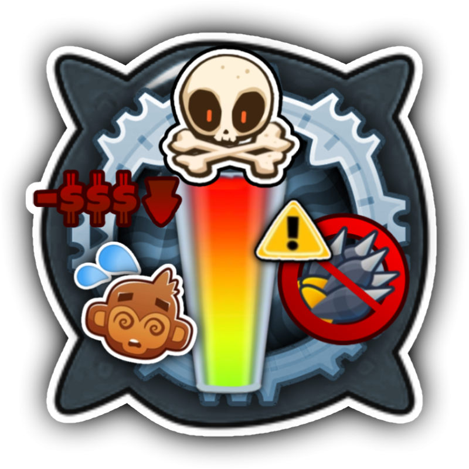

<h1 align="center">Introducing Tower Tactics!</h1>

### What is Tower Tactics?

Tower Tactics is a mod that revamps the entire tower system with three mechanics:

- * Fatigue
- * Taxes
- * Ammo

### How does Fatigue Work?

Every time a tower shoots, there is a 1/40 chance it will become more fatigued.
- At 30 fatigue, the tower takes an extra 5 seconds to shoot.
- You can reset its fatigue and rate by feeding it bananas.
- You can buy bananas from the shop.
- Fatigue works per tower type, so if one Dart Monkey gets fatigued, all Dart Monkeys will also be fatigued.

### How do Taxes Work?

Every 10 rounds, you will need to pay the tower's taxes.
- If you don't pay, they will quit the war.
- If you do pay, they will stay with you at the cost of 30% of your money.

### How does Ammo Work?

Every time a tower shoots, its ammo decreases by 1.
- When you run out of ammo, your tower will become useless.
- You can buy ammo from the shop!

<h1 aling="left"></h1>

